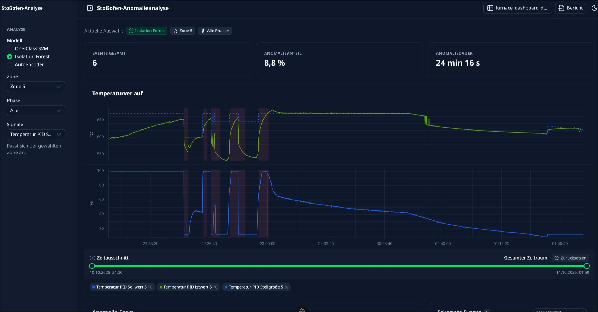

# Stoßofen-Anomalieanalyse — Dashboard

Ein Web-Dashboard, in das man **eine** aufbereitete CSV eines Sechs-Zonen-Stoßofens
lädt. Es zeigt den Zeitverlauf der Prozesssignale einer Zone und — sobald die CSV
Modellergebnisse enthält — wo ein Anomalieerkennungsmodell angeschlagen hat.

   
---

## Starten

Online Versionen:
- [Dashboard->](https://ml-dashboard.laschober.eu/)
- [Beispiel Datei zm Download (einfach danach im Leeren Dashboard uploaden) ->](https://ml-dashboard.laschober.eu/sample-data/furnace_dashboard_demo_full.csv)


Oder Lokal starten:

**Einmalig:** [Node.js](https://nodejs.org) (LTS-Version) installieren — dann im Projektordner:

```bash
npm install
npm run dev
```

Wenn im Terminal `http://localhost:3000/` steht, diese Adresse im Browser öffnen.

### Eine CSV laden

Oben rechts, oder in der Mitte oder in der Sidebar auf **„CSV importieren"** klicken (solange noch keine geladen ist) und eine Datei
auswählen (oder ins Feld ziehen). Die Datei bleibt nach einem Reload erhalten
(im Browser gespeichert), bis man sie über denselben Dialog wieder entfernt.

Zum Ausprobieren ohne echte Daten gibt es fertige Beispiele. Sie liegen im Ordner
`sample-data/` **und** werden vom laufenden Dashboard mit ausgeliefert — also auch
im Docker-Container — unter `http://<adress>/sample-data/<datei>`:

| Datei | Modus / Inhalt |
|---|---|
| `furnace_dashboard.csv` | Prozessmodus (nur Signale) |
| `furnace_dashboard_demo_analyse.csv` | Analysemodus, nur `svm` |
| `furnace_dashboard_demo_full.csv` | Analysemodus, **alle drei Modelle** (svm · iforest · autoencoder) — zum Durchklicken der ganzen Funktionalität |
| `furnace_dashboard_demo_iforest.csv` / `_autoencoder.csv` | Analysemodus, je ein Modell |

Also z. B. `http://localhost:3000/sample-data/furnace_dashboard_demo_full.csv` im
Browser öffnen (lädt die Datei herunter) und dann über den CSV-Import wieder
hochladen.

Alle `score_*`/`flag_*`-Werte in diesen Dateien sind **synthetisch** (erzeugt von
`sample-data/make_analysis_demo.py`), sie ersetzen keine echte Modellausgabe.

---

## Entwickeln & veröffentlichen

Zwei Branches: **`dev`** = Arbeitsstand, **`master`** = live. Ein Merge nach `master`
published das Dashboard automatisch auf den Server (GitHub Action → Docker).

Einmal klonen (oder GitHub Desktop nutzen — dort machen Buttons dasselbe):

```bash
git clone <repo-url>
```

Auf `dev` arbeiten:

```bash
git checkout dev
git pull
git add -A
git commit -m "kurz was geändert wurde"
git push
```

**Veröffentlichen:** auf github.com einen Pull Request `dev` → `master` erstellen.
Ein Check baut zuerst das Docker-Image (`.github/workflows/pr-check.yml`) — erst wenn
der grün ist, lässt sich mergen. Nach dem Merge deployt die Action automatisch; nach
ein paar Minuten ist die neue Version unter der Domain online.
**Direkte Commits auf `master` sind gesperrt.**

---

## Zwei Betriebsarten (erkennt das Dashboard selbst an den Spalten)

| Modus | wenn die CSV … | Anzeige |
|---|---|---|
| **Prozessmodus** | nur Prozesssignale hat | Signalauswahl + Temperaturverlauf |
| **Analysemodus** | zusätzlich `score_*` / `flag_*`-Spalten hat | + KPIs, Anomalie-Score, Ereignisliste |

---

## Das CSV-Format

Eine Datei, so aufgebaut:

- Trennzeichen **`,`** · Dezimaltrennzeichen **`.`** (Punkt) · Kodierung **UTF-8**
- erste Zeile = **Spaltennamen**, jede weitere Zeile ein Zeitpunkt
- Zeitstempel in der Spalte **`time`** im Format **ISO 8601**: `2025-10-10T00:03:42.320`
- Fehlwerte: leere Zelle oder `NaN`

Zonen, Modelle und verfügbare Signale liest das Dashboard **aus den Spaltennamen** —
nichts ist fest verdrahtet. Enthält die Datei nur `z1_*`- und `z2_*`-Spalten, sind
auch nur Zone 1 und 2 mit Daten gefüllt.

Ein versehentlich hochgeladener Anlagen-Rohexport (`;`-getrennt, Dezimalkomma,
Zeitstempel `TT.MM.JJJJ hh:mm:ss`) wird notdürftig erkannt, greift dann aber nur im
Prozessmodus. Für den vollen Funktionsumfang vorher mit dem Skript aufbereiten
(siehe „Daten aufbereiten").

### Spalten

| Spalte | Typ | Pflicht | Bedeutung |
|---|---|---|---|
| `time` | ISO 8601 | **ja** | gemeinsame Zeitachse |
| `z<N>_<gruppe>_<rolle>` | Zahl | **ja** | Prozesssignal, `N` = Zone 1–6 (siehe unten) |
| `phase` | `heating` / `hold` / `cooling` | nein | Prozessphase — fehlt sie, gibt es keinen Phasenfilter |
| `cycle` | ganze Zahl | nein | fortlaufende Chargennummer |
| `x_<name>` | Zahl | nein | Signale ohne Zonenbezug (z. B. Tür, Ofensequenz) |
| `score_<modell>_z<N>` | Zahl 0–1 | nein | Anomalie-Score, 1 = sehr auffällig → aktiviert den Analysemodus |
| `flag_<modell>_z<N>` | `0` / `1` | nein | Punkt liegt über dem Schwellwert → aktiviert den Analysemodus |

`<modell>` ist eines von **`svm`**, **`iforest`**, **`autoencoder`**.

### Signalschlüssel `z<Zone>_<Gruppe>_<Rolle>`

Acht Gruppen, je Zone 18 Signale:

| Gruppe | Rollen | Einheit | Bezeichnung |
|---|---|---|---|
| `temp` | `sp` `pv` `mv` | °C, °C, % | Temperaturregelung |
| `wind_ahead` | `sp` `pv` | °C | Vorluft |
| `wind_beyond` | `sp` `pv` | °C | Rückluft |
| `err_ahead` | `err` | °C | Regelfehler Vorluft |
| `err_beyond` | `err` | °C | Regelfehler Rückluft |
| `air` | `sp` `pv` `mv` `flow` | %, %, %, Nm³/h | Verbrennungsluft |
| `gas` | `sp` `pv` `mv` `flow` | %, %, %, Nm³/h | Brenngas |
| `ratio` | `ratio` | – | Luft/Gas-Verhältnis |

Rollen: `sp` = Sollwert · `pv` = Istwert · `mv` = Stellgröße · `flow` = Durchfluss ·
`err` = Regelfehler. Beispiele: `z1_temp_pv`, `z3_air_flow`, `z2_err_ahead_err`.

### Beispiel (gekürzt)

```csv
time,phase,cycle,z1_temp_sp,z1_temp_pv,z1_temp_mv,z1_air_flow,score_svm_z1,flag_svm_z1
2025-10-10T00:03:42.320,hold,4,670,671.4,86.801,3536.1,0.12,0
2025-10-10T00:03:43.320,hold,4,670,671.2,86.780,3540.0,0.63,1
```

Ohne die `score_*`/`flag_*`-Spalten ist es dieselbe Datei im Prozessmodus.

---

## Aktuelle Features

- **CSV-Import** oben in der Leiste: Datei-Dialog und Drag & Drop, Fortschrittsbalken,
  große Dateien werden stückweise eingelesen (ab ~800 000 Zeilen gleichmäßig
  ausgedünnt), Datei bleibt über Reloads erhalten.
- **Automatische Moduserkennung** Prozess- / Analysemodus.
- **Sidebar** mit allen Analyse-Einstellungen:
  - Modell: One-Class SVM · Isolation Forest · Autoencoder
  - Zone 1–6 (immer wählbar; Zonen ohne Daten in der CSV zeigen im Plot einen Hinweis)
  - Phase: Aufheizen · Halten · Abkühlen · Alle
  - Signalauswahl, mehrere gleichzeitig, Liste passt sich automatisch der Zone an
- **Auswahlzeile** im Hauptbereich zeigt Modell / Zone / Phase.
- **KPIs** (Analysemodus): Events gesamt · Anomalieanteil in % · gesamte Anomaliedauer.
- **Temperaturverlauf**: Zeit als X-Achse, Sollwerte gestrichelt, Legende zum
  Ein-/Ausblenden, Anomaliebänder im Analysemodus. Je Einheit (°C, %, Nm³/h …) ein
  eigenes Panel untereinander, alle mit derselben Zeitachse und demselben Zoom;
  Zeitbeschriftung am untersten Panel.
- **Zeitausschnitt-Zeile** unter dem Diagramm: Bereichsregler (Doppel-Schieber) für
  den sichtbaren Zeitraum, mit angezeigtem gewählten Zeitraum (aktualisiert sich beim
  Ziehen) und Anfang/Ende des Gesamtzeitraums, plus „Zurücksetzen". Beim Loslassen
  werden nur die Daten des gewählten Ausschnitts neu geladen, ohne Animation.
- **Anomalie-Score** (Analysemodus): Score-Verlauf mit Schwellwertlinie, gleicher
  Zeitausschnitt wie der Temperaturverlauf.
- **Erkannte Events** (Analysemodus): sortierbare Liste, sehr kurze Ereignisse
  zusammengefasst.
- **Verknüpfte Interaktion**: Ereignis in der Liste anklicken → beide Plots springen
  auf den Zeitbereich und heben ihn hervor; Klick auf ein Band im Plot macht dasselbe;
  „Zurücksetzen" geht zurück auf den vollen Bereich.
- **Bericht** oben in der Leiste: Export der gefilterten Rohzeilen als CSV (mit
  Modell / Zone / Phase / Zeitfenster im Dateikopf) und eine Druck- / PDF-Ansicht.
- **Hell-/Dunkel-Umschalter**.
- **Dockerfile** für einen mehrstufigen Produktions-Build mit Nuxt/Nitro; die
  Beispieldatensätze aus `sample-data/` werden mit ausgeliefert (`/sample-data/…`).
- Oberfläche durchgehend deutsch, alle Zahlen und Daten im deutschen Format,
  jeder Leerzustand mit erklärendem Text.

---

## Projektaufbau (grob)

```
app/
  pages/index.vue           die eine Seite
  layouts/default.vue       Rahmen: Sidebar + Hauptbereich
  components/
    navbar/                 CSV-Import, Bericht (Export/Druck)
    sidebar/                Modell-, Zone-, Phase-, Signalauswahl
    dashboard/              Auswahlzeile, KPIs, Ereignisliste, Hinweise
    TemperatureChart.*      der große Signal-Plot
    AnomalyScoreChart.*     der Score-Plot
  composables/              die Logik (Daten laden, Auswahl, Interaktion, Export)
  utils/
    signals.ts              Katalog aller 108 Signale
    format.ts               deutsche Zahlen-/Datums-/Dauerformate
scripts/prepare_dashboard_data.py   Rohexport der Anlage -> Dashboard-CSV
sample-data/                Beispieldateien + make_analysis_demo.py
```

`*.client.vue` / `*.server.vue`: die Charts brauchen den Browser, deshalb sind sie
in eine Client- und eine Platzhalter-Server-Variante geteilt.

---

## Daten aufbereiten

Der Rohexport der Anlage (`;`-getrennt, deutsches Zahlenformat) lässt sich nicht
direkt laden. Das Skript macht daraus eine Dashboard-CSV:

```bash
python3 scripts/prepare_dashboard_data.py <rohexport>.txt -o furnace_dashboard.csv
python3 scripts/prepare_dashboard_data.py --help 
```

Nur Python-Standardbibliothek, kein pandas nötig. Für sehr große Exporte
`--every N` (nur jede N-te Zeile).

**Synthetische Demo-Scores** an eine fertige Dashboard-CSV hängen (nur zum Vorführen
des Analysemodus, keine echte Modellausgabe):

```bash
python3 sample-data/make_analysis_demo.py <eingabe>.csv -o <ausgabe>.csv
python3 sample-data/make_analysis_demo.py <eingabe>.csv -o <ausgabe>.csv -m iforest
```

---

## Nützliche Befehle

```bash
npm run dev        # Dev-Server (http://localhost:3000)
npm run lint       # Stilprüfung
npm run typecheck  # TypeScript-Prüfung
npm run build      # Produktions-Build (prüft, ob alles zusammenpasst)
```

---

## Mit Docker starten (optional)

Nur nötig, wenn das Dashboard ohne Node-Installation laufen soll:

```bash
docker build -t furnace-dashboard .
docker run --rm -p 3000:3000 furnace-dashboard
```

Danach ebenfalls unter `http://localhost:3000`.
